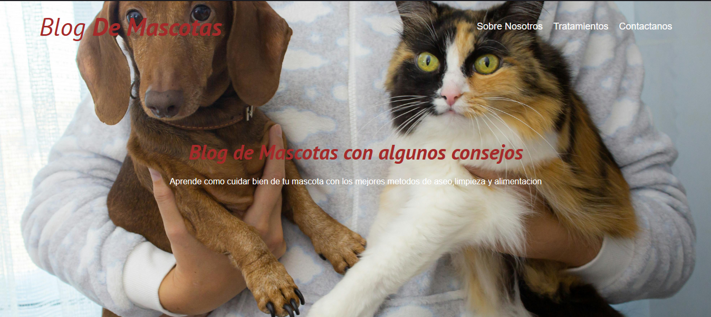
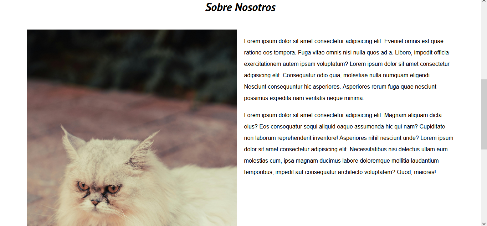
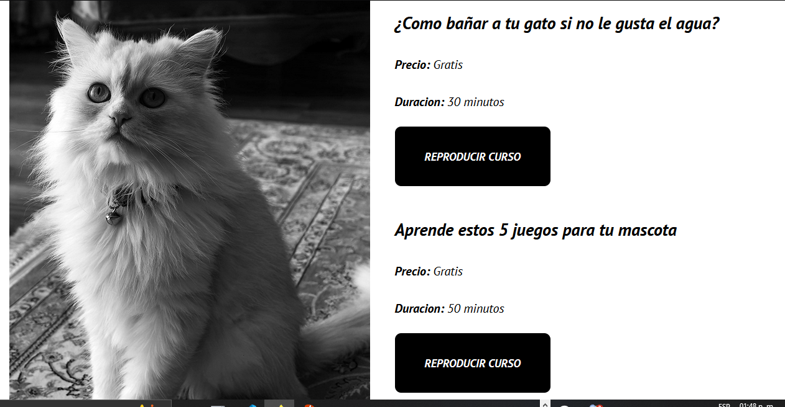
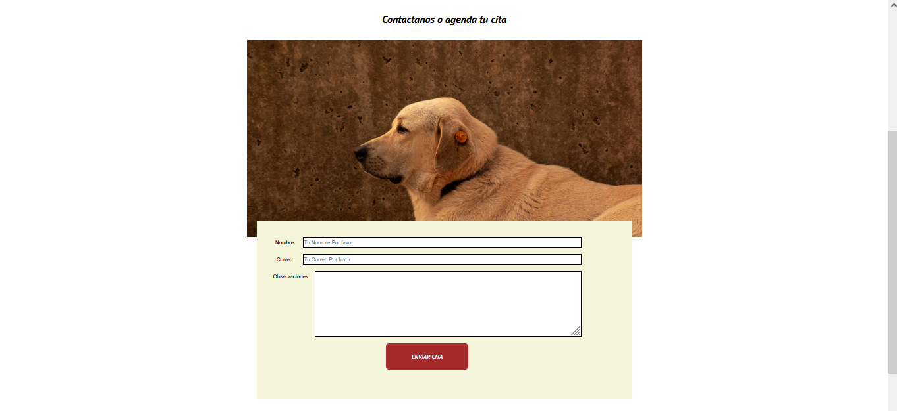

## Blog de Mascotas 

Proyecto estatico diseñado y desarrollado en **HTML5** y **CSS3** con algunas entradas de blog,para compartir articulos,consejos y curiosidades sobre el cuidado de las mascotas.Este blog presenta un diseño limpio,responsivo y moderno,usando el nuevo enfoque de **Mobile First** y tambien compatible con laptop.

## Caracteristicas principales 

- Sitio **100% estatico** (sin frameworks).
- Diseño **responsive** adaptable a diferentes dispositivos.

- Uso de **variables css** y organizacion modular en los estilos.
- Tipografia y paleta de colores suaves para una lectura agradable.
- Incluye secciones como:

    - Inicio
    - Cursos
    - Nosotros
    - Contacto

## Capturas del proyecto 
| Pagina | Vista |

**Inicio** |  Portada de nuestro blog

**Nosotros** |  Seccion sobre nosotros

**Cursos** |  Entradas de blog con botones clicables

**Contacto** |  Seccion de formulario para contactarnos

## Estructura del proyecto 

```
blog-mascotas/
    ├css/
    ├normalize.css
    └style.css
img/
    ├portada.png
    ├about.png
    ├cursos.png
    └contacto.png
├index.html
├nosotros.html
├cursos.html
├contacto.html
```
## Autor
Diseñado y desarrollado por **AbelVOrtuno** 

Año: 2025

Ubicacion: Acapulco, Mexico

(**Nota**):

Este proyecto forma parte de mi portafolio personal como desarrollador web Front-End.Para mas informacion o colaboracion con este y mas proyectos visita mi pagina de Spiral Web Studio.